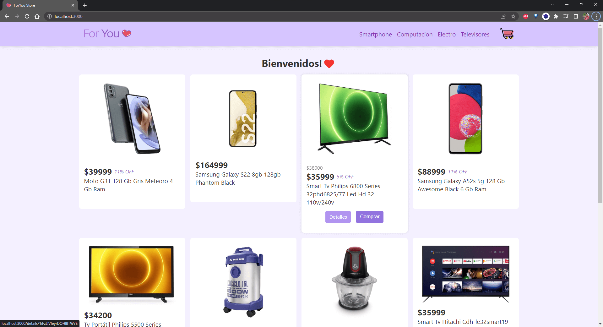
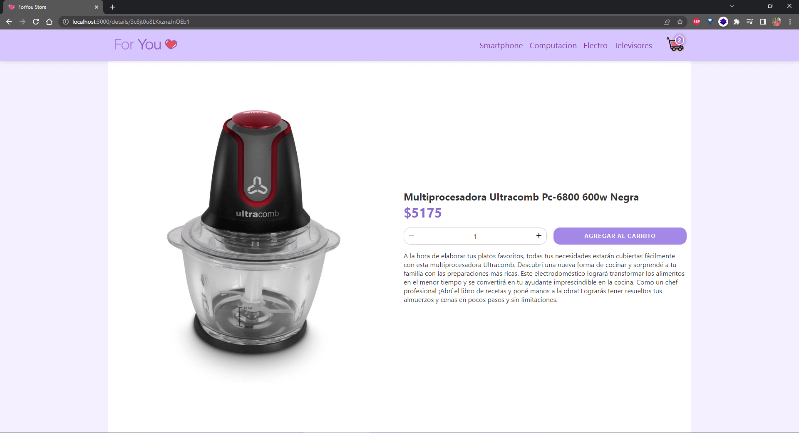
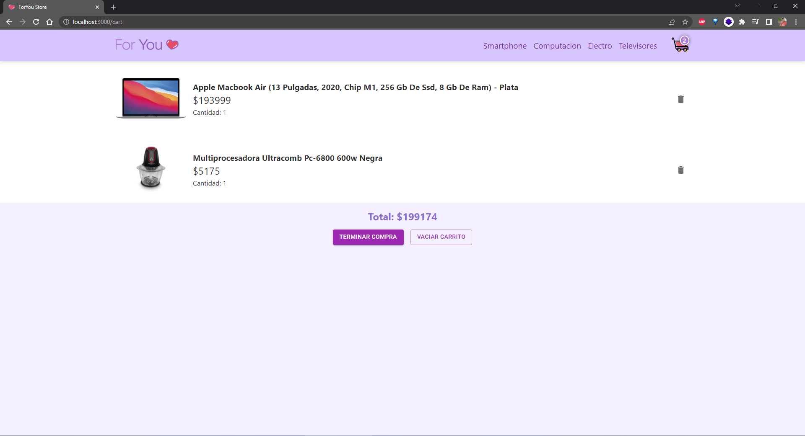

# Tienda online ForYou

Bienvenidos al proyecto final del curso de __React.js__ de __Coderhouse__.
Aquí podrás encontrar una tienda online donde podrás comprar productos para tu hogar.

## Sobre el proyecto
Esta tienda fue realizada durante el transcurso del curso, con el objetivo de poner en práctica los conocimientos adquiridos en un proyecto que implica varios desafios.
Está realizado bajo el framework de React.js con un enfoque basado en componentes funcionales. Esto permite que sea un proyecto escalable y que se pueda extender en futuras versiones.
Asimismo, se desarrolló con la metodologia "mobile first" para que se adapte a todos los dispositivos.

## Screenshots
- Home:

- Detalle del producto:

- Carrito:

- Demo:

## Dependencias
* React.js: Una de las librerias mas populares actualmente. Encontrá más info en [https://reactjs.org/](https://reactjs.org/)
* React Router DOM: Para manejar con facilidad las rutas de la aplicación. [https://reactrouter.com/](https://reactrouter.com/)
* Material-UI: Para múltiples interfaces de la aplicación. [https://material-ui.com/](https://material-ui.com/)

## Instalación
Para instalar la aplicación, se deben realizar los siguientes pasos:
1. Clonar el repositorio de GitHub
~~~
git clone https://github.com/nicolasrodriguez3/eccomerce-rodriguez.git
~~~
2. Posicionarse dentro de la carpeta clonada
~~~
cd eccomerce-rodriguez
~~~
3. Realizar la instalación de las dependencias utilizadas.
~~~
npm install
~~~
4. Iniciar un servidor local para visualizar el mismo en el navegador.
~~~
npm start
~~~

## Sobre mí
Soy Nicolás Rodríguez y te invito a seguirme en mis redes sociales:

- [Github](https://github.com/nicolasrodriguez3)
- [Linkedin](https://www.linkedin.com/in/nirodriguez/)
- [Twitter](https://twitter.com/nicolasrodriguez)