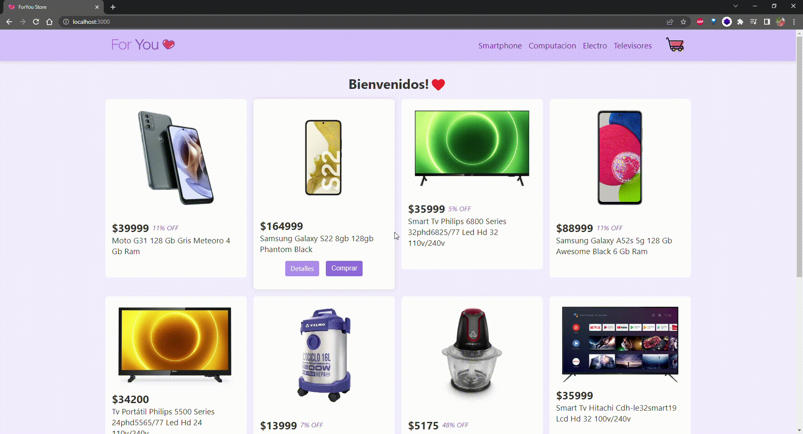

# ForYou tienda online

Bienvenidos a el proyecto final del curso de React.js de Coderhouse.
Aquí podrás encontrar una tienda online donde podrás comprar productos para tu hogar.

## Sobre el proyecto
Esta tienda fue realizada durante el transcurso del curso, con el objetivo de poner en practica los conocimientos adquiridos en un proyecto que implica varios desafios.
Esta realizado bajo el framework de React.js con un enfoque basado en componentes funcionales. Esto permite que sea un proyecto escalable y que se pueda extender en futuras versiones.
Asi mismo, se dasarrollo con la metodologia "mobile first" para que se adapte a todos los dispositivos.

## Screenshots

## Sobre mí
Soy Nicolás Rodríguez y te invito a seguirme en mis redes sociales:

- [Github](https://github.com/nicolasrodriguez3)
- [Linkedin](https://www.linkedin.com/in/nirodriguez/)
- [Twitter](https://twitter.com/nicolasrodriguez)